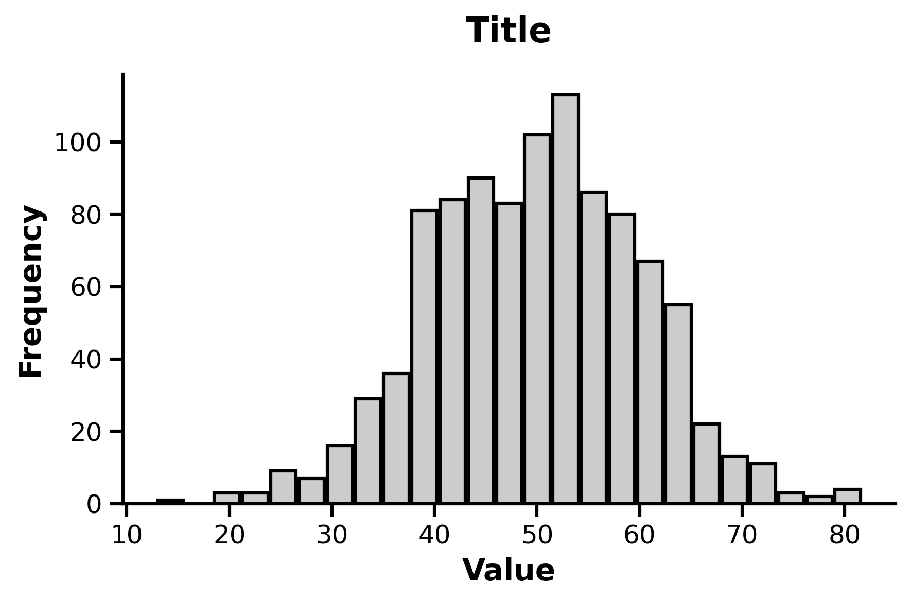

# 直方图 - 八度灰风格 (Histogram Chart Octave Gray Style)

这是一个用于生成经典直方图（Histogram）的 matplotlib 示例，采用八度灰配色及 GraphPad Prism 类似的边框风格。

## 📊 效果预览



## ✨ 核心特性

* **Graphpad样式预设**：通过 `assets/single_histogram_chart.mplstyle` 实现了字体、轴线粗细、颜色等底层样式的全局接管。
* **智能分组逻辑**：内置 `calculate_optimal_bins` 函数，采用 **Freedman-Diaconis 准则** 根据数据分布自动计算最优分组数，避免手动调整的烦恼。

## 🚀 快速运行

确保你已经配置好了 Conda 环境（`Matplotlib_Medial_Customed_Styles`）。然后在当前目录下运行：

```bash
python example.py
```

运行后，图表将自动生成并保存在 `./img/example.png`。此外代码还会同步输出一份 `.pdf` 格式文件以供高质量学术排版使用。

## 🛠️ 如何替换为你自己的数据？

打开 `example.py`，修改以下几个核心变量即可快速应用到你的研究数据中：

```python
# 1. 文本信息
xlabel = 'Your X-axis Label'
ylabel = 'Your Y-axis Label'
title = 'Your Plot Title'

# 2. 数据信息
# 将 data 替换为你自己的一维数据列表或数组（np.ndarray 或 list）
data = np.random.normal(loc=50, scale=10, size=1000)

# 3. 智能分组设置
# 脚本会调用 calculate_optimal_bins(data) 自动计算最优 bins 
# 如果你仍想手动指定 bins 数量，可以直接修改 ax.hist 处：
# ax.hist(data, bins=20, rwidth=0.9)
optimal_bins = calculate_optimal_bins(data)
ax.hist(data, bins=optimal_bins, rwidth=0.9)
```
